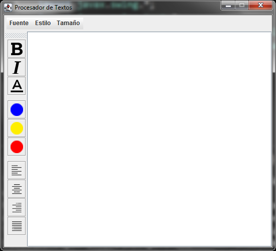
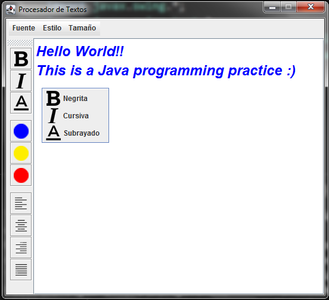
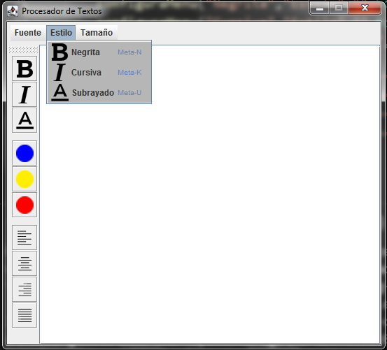

# Procesador de textos Basico en Java
Práctica de procesador de textos básico con Java

El procesador consiste simplemente en las siguientes secciones principales:
- El área para escribir (JTextPane)
- Menu desplegable con opciones:
  - Fuente (Arial, Courier, Verdana)
  - Estilo (Negrita, Cursiva, Subrayado) con combinaciones de teclas incluidas
  - Tamaño (12,16,20,24)
- Barra de Herramientas
  - Para cambiar estilo (Negrita, Cursiva, Subrayado)
  - Para cambiar color (Azul, Amrillo, Rojo)
  - Para cambiar alineacion (Izquierda, centro, Derecha, Justificado)
- Mini menu desplegable al hacer click derecho con opiones para cambiar el 
estilo (Negrita, Cursiva, Subrayado)

Esta practica fue realizada a partir del ejercicio propuesto en el curso de Java
de pildorasinformaticas (canal de Youtube)

https://www.youtube.com/user/pildorasinformaticas

//----------------VENTANA PRINCIPAL----------------//

